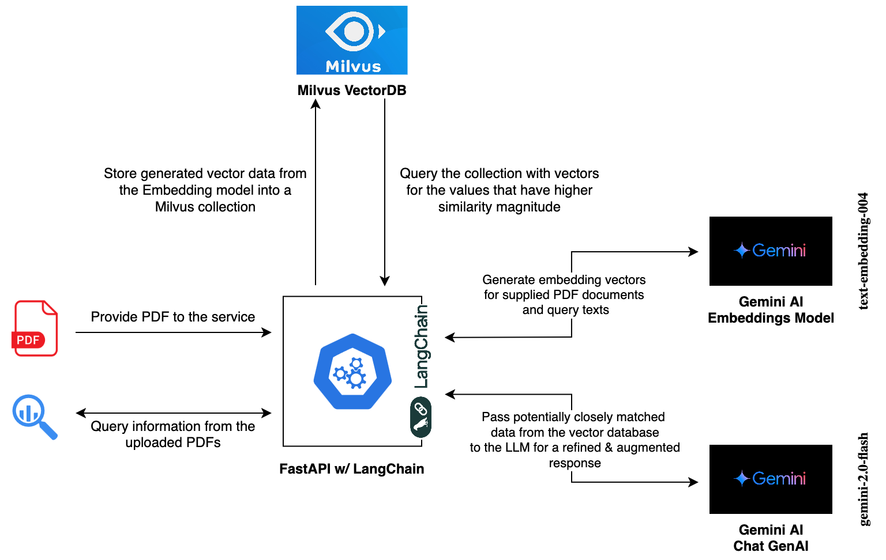

# RAG for PDFs with LangChain & Gemini AI 

### A simple FastAPI app implementing a RAG workflow with Gemini AI models via LangChain

  

#### Overview
The application accepts a PDF file source, and answers queries (in a natural language) about the contents in the PDF. It integrates with Gemini AI with LangChain's interfaces to Google's models.
It uses the enlisted models:
- `gemini-2.0-flash` - For GenAI chat LLM to generate augmented responses with a natural tone
- `text-embedding-004` - To generate the embedding vectors for the PDF and also the query text

> Note - 
> The model can be improved both in terms of the vector database optimization, and a better integration of LangChain's capabilities. That's part of the progress as I learn more.
